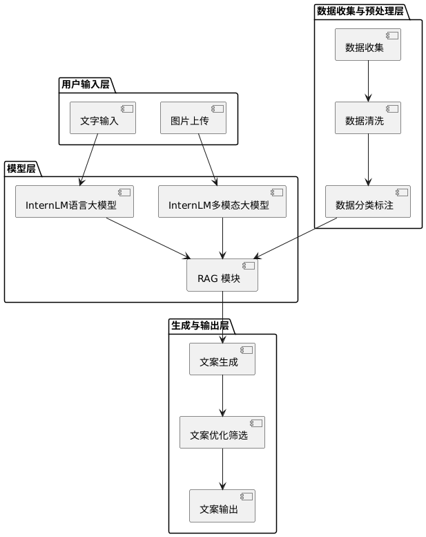

# llm-copy
输入文字或者图片利用大模型生成社交媒体文案。
## 背景
很多朋友会经常会碰到这个问题，想发朋友圈或者抖音小红书表达某种感觉，需要写一段文案，或者平时拍了好看的照片，想配上文案，现有的大模型也能写一些文案，但是还是很多时候不够满意。
## 计划
计划用InternLM大模型 学习这个https://github.com/InternLM/Tutorial 来结合其他工具模型来做rag或者微调收集的文案数据，实现输入文字想要什么感觉的文案，或者输入图片生成合适的文案。

## 架构图

